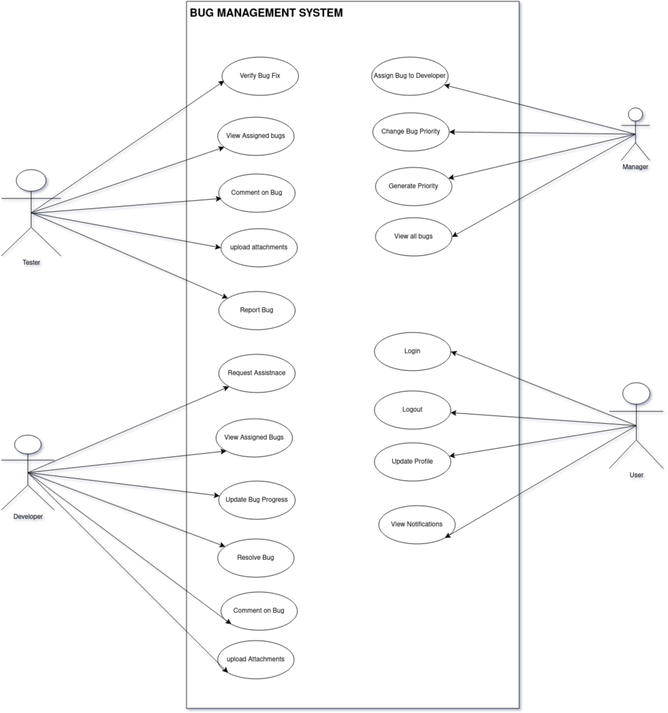
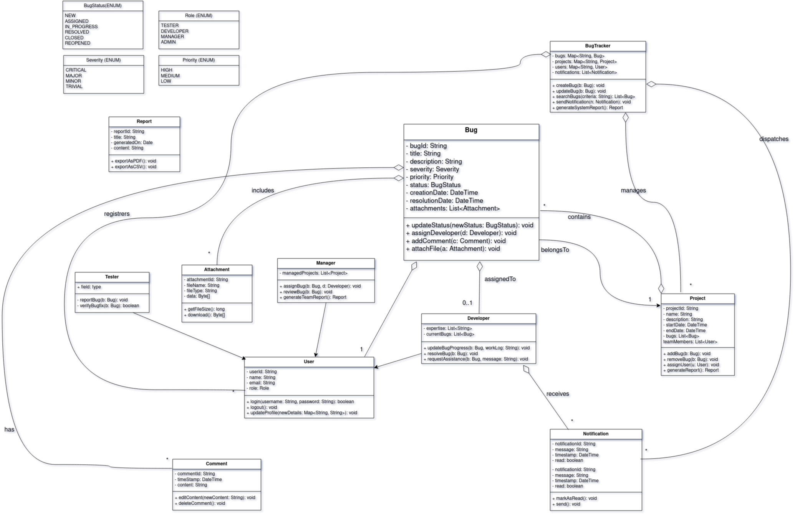
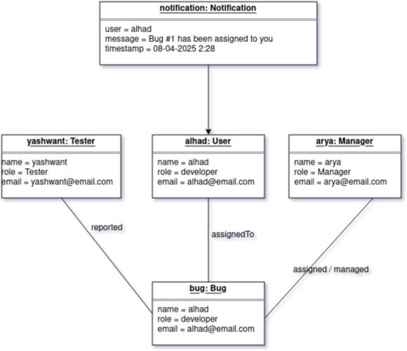
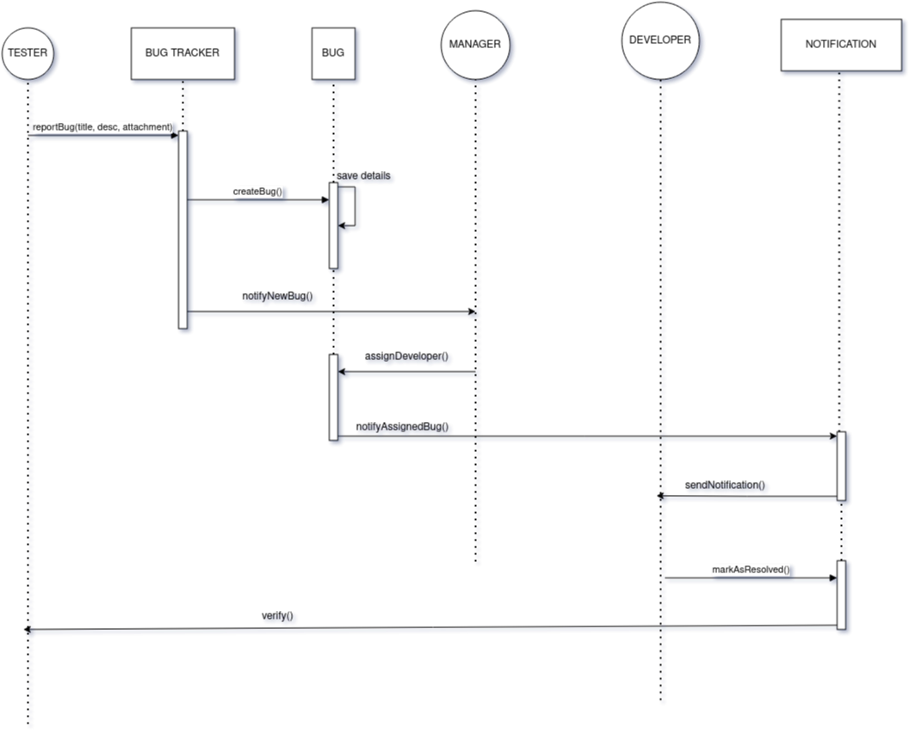
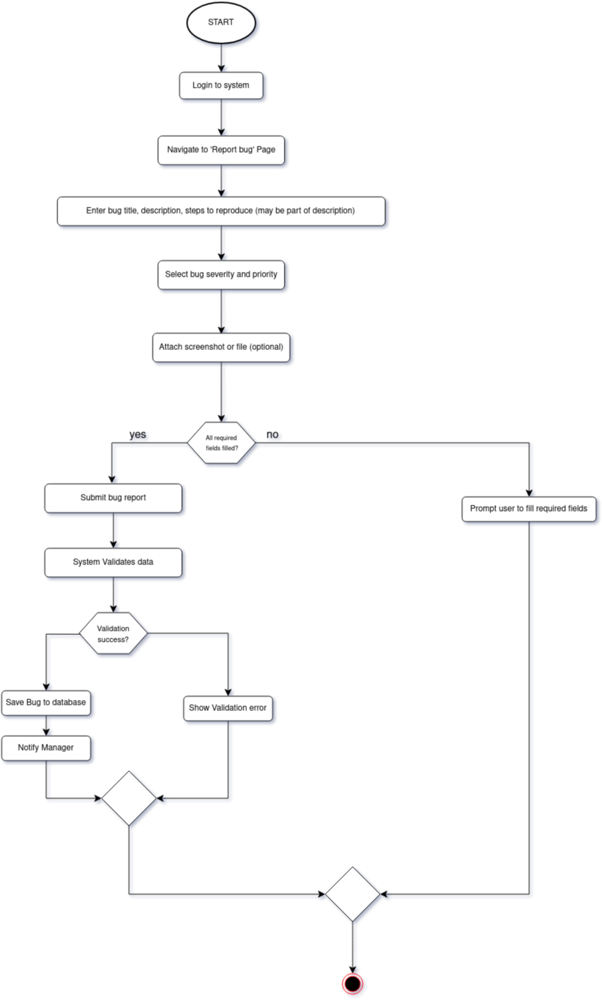
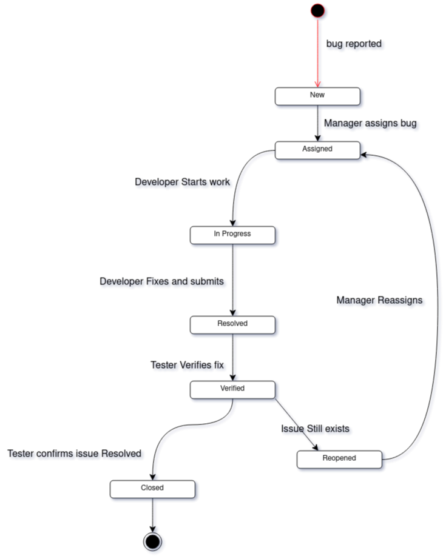
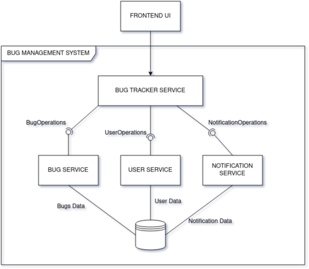
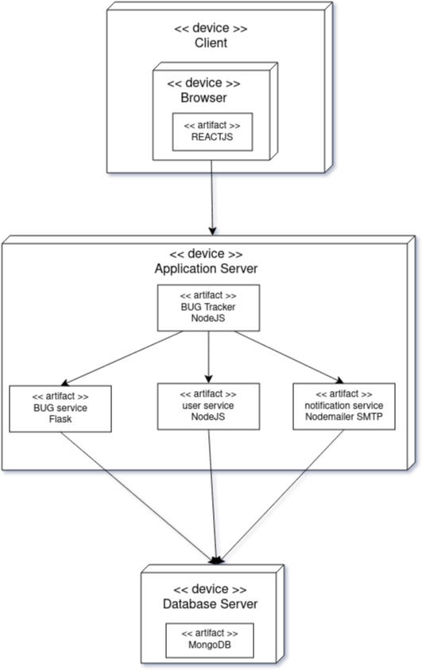

# Bug Management System

## Problem Statement

Software development teams often face challenges in effectively tracking, managing, and resolving bugs across multiple projects. The Bug Management System provides an integrated solution for testers, developers, and managers to collaborate, streamline bug reporting, assignment, and resolution, and improve software quality assurance.

---

## UML Diagrams

### 1. Use Case Diagram

---

### 2. Class Diagram

---

### 3. Object Diagram

---

### 4. Sequence Diagram

---

### 5. Activity Diagram

---

### 6. State Diagram

---

### 7. Component Diagram

---

### 8. Deployment Diagram

